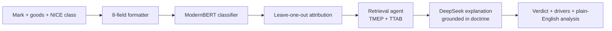

# Mark Checker — is your brand name registrable?

Type in a brand name and what you sell. The app predicts whether the name is distinctive
enough to register as a trademark, shows which words drove that call, and explains it in
plain English backed by real trademark law.

**[Live demo](https://TODO-demo-url)** · <!-- screenshot: docs/assets/result.png (TODO) -->


## The problem

Trademark law grades every brand name on a scale that runs from *generic* (the plain word
for the product, never protectable) through *descriptive* and *suggestive* to *fanciful* (an
invented word like "Kodak"). Where a name lands on that scale — the Abercrombie spectrum —
decides whether the trademark office will register it.

That grade is a judgment call. A trademark lawyer reads the name, the goods, and decades of
past decisions, then forms an opinion. For a small business owner the opinion costs hundreds
of dollars and takes days, and two lawyers can disagree. This app gives an instant first
read so an applicant knows where they stand before they pay for advice.

## What the app does

One example. You enter the mark **ZEPHYRLINE**, goods *"insulated water bottles"*, NICE
class 21.

- **Verdict:** distinctive · **confidence:** high
- **Words that drove it:** the mark text `ZEPHYRLINE` pushed hardest toward distinctive; the
  goods description barely moved the needle.
- **Why:** the coined word has no meaning tied to drinkware, so it reads as fanciful or
  arbitrary. The analysis cites the TMEP section on coined marks and a TTAB decision on a
  comparable invented mark.

## How it works

1. The app formats your input into the same 8-field string the model was trained on
   (mark, goods, translation, dictionary flag, length, NICE class and description, pseudo
   mark).
2. A fine-tuned ModernBERT classifier returns a probability that the mark is distinctive.
3. Leave-one-out attribution blanks each field in turn and measures the swing, so you see
   which fields carried the verdict.
4. A retrieval agent writes targeted queries against a doctrine store (TMEP sections and
   TTAB decisions) and collects the passages that fit this mark.
5. DeepSeek writes the four-section explanation, grounded in the retrieved doctrine and told
   to cite only sections that were actually retrieved.



## Engineering highlights

- **Fine-tuned ModernBERT instead of a prompt to a general LLM.** The task is a narrow
  binary judgment over a fixed input shape. A fine-tuned encoder is cheaper, faster, and
  more consistent than a prompted general model, and it runs on CPU with no per-call cost.
- **A RAG layer grounds the analysis in doctrine.** Left alone, an LLM invents plausible
  TMEP citations. The retrieval step forces the explanation to cite sections that were
  actually pulled from the store, so the output is checkable against the source.
- **A tool-calling agent writes the doctrine queries.** Instead of one flat similarity
  search, the agent reasons about the mark, queries TMEP and TTAB in parallel with precise
  Abercrombie vocabulary, and refines once if the first hits miss. It routes a surname mark
  to surname doctrine without being hard-coded to.
- **Feature attribution makes the verdict auditable.** Every result shows the per-field
  contribution, so a user sees whether the mark text or the goods description drove the
  call — not just a number.
- **A 50-case regression suite guards against model drift.** `tests/test_model_predictions.py`
  pins 50 known-good predictions; a checkpoint swap that breaks them fails CI.
- **Safe public deployment.** Per-IP rate limits, a Cloudflare Turnstile check on the paid
  LLM endpoint, and a Cloudflare Tunnel that keeps the backend off the public internet.

## Tech stack

| Layer | Choice | Reason |
|---|---|---|
| Classifier | Fine-tuned ModernBERT-base (Transformers) | Narrow task, fixed input shape, CPU-friendly, no per-call cost |
| Attribution | Leave-one-out over the 8 input fields | Field-aligned, model-agnostic, cheap (one batched forward pass) |
| Retrieval | DeepSeek tool-calling agent + ChromaDB (embedded) | Self-correcting queries; no vector-DB server to run |
| Embeddings | bge-base-en-v1.5 | Strong open retrieval model, runs locally |
| Analysis LLM | DeepSeek (`deepseek-chat`, OpenAI-compatible SDK) | Low cost, adequate for grounded summarization |
| Backend | FastAPI + Uvicorn | Async, typed request models, small surface |
| Frontend | React + Vite | Simple three-call pipeline UI |
| Deploy | Docker Compose + Nginx + Cloudflare Tunnel | One-command stack, no inbound ports |

## Documentation

| Doc | Contents |
|---|---|
| [docs/API.md](docs/API.md) | The four endpoints, request and response shapes, rate limits, input format |
| [docs/RAG.md](docs/RAG.md) | Doctrine store, the retrieval agent, index builds, retrieval eval |
| [docs/DEPLOYMENT.md](docs/DEPLOYMENT.md) | Docker, Cloudflare Tunnel, the security checklist, CI/CD, troubleshooting |
| [docs/DEVELOPMENT.md](docs/DEVELOPMENT.md) | Local run, tests, smoke test, project structure |
| [docs/PLAN.md](docs/PLAN.md) | Design decisions behind the RAG layer |

## Quick start

```bash
cp .env.example .env                                   # set HF_MODEL_ID
CHROMA_PATH=./data/chroma python scripts/build_rag_index.py   # baseline doctrine index
docker compose up --build                               # UI at http://localhost
```

See [docs/DEPLOYMENT.md](docs/DEPLOYMENT.md) for the full setup and a public deployment.

## Status and limits

This is a decision-support tool, not legal advice. It returns a binary distinctive /
not-distinctive call, not a full Abercrombie tier, and it does not check for conflicting
existing marks, assess acquired distinctiveness, or predict what a specific examiner will
do. The classifier learned from past USPTO decisions, so it reflects how examiners have
ruled, not only what the doctrine requires — the RAG layer exists to narrow that gap. Treat
the output as a starting point for a conversation with a trademark attorney.

---

Built by [Vy Nguyen](https://TODO-portfolio-url). The classifier extends an MS thesis on
automating the Abercrombie classification.
