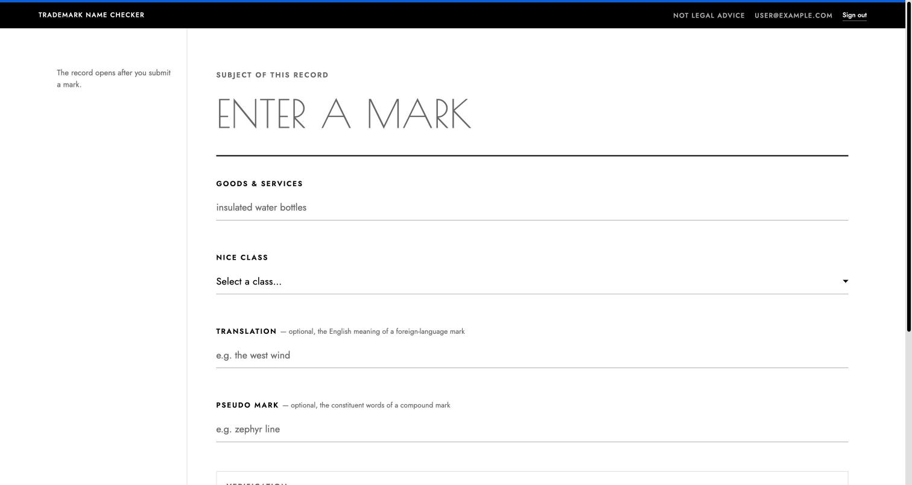
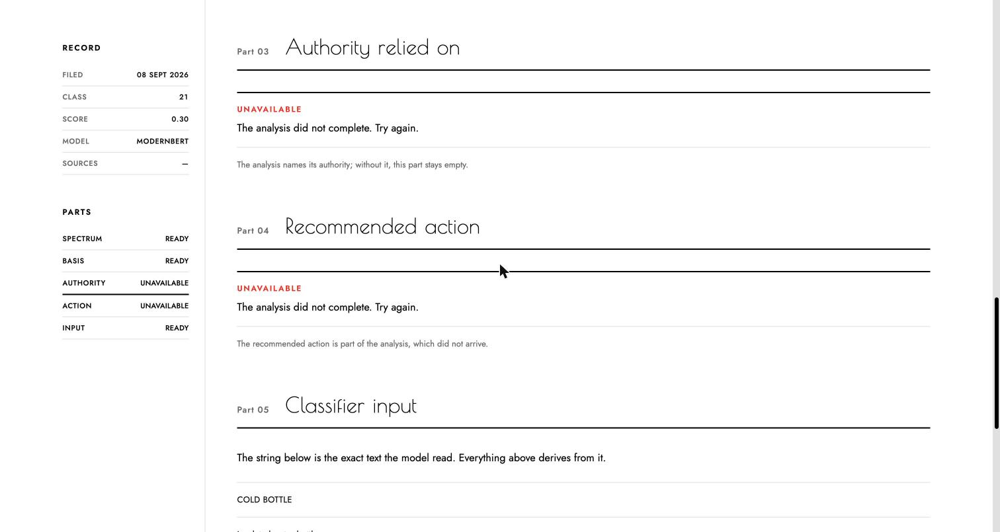
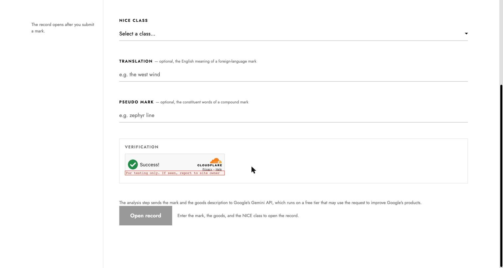
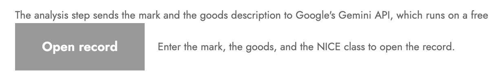
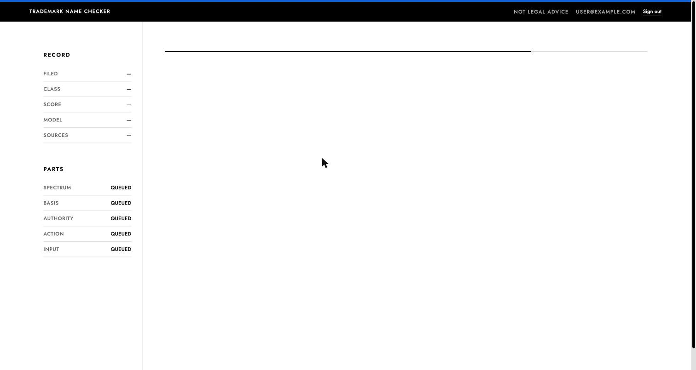
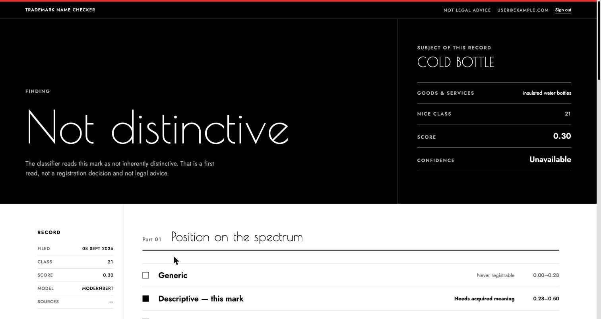
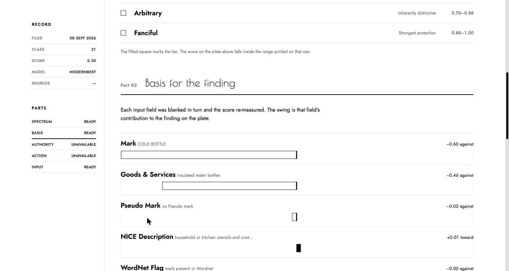

# Frontend Critique — Look, Legibility, Polish

Scope: the visual surface only. This document covers what the page looks like, what the eye
finds first, and where the interface breaks its own design language. It does not cover the
pipeline, the model, or the backend.

Target: `frontend/src/App.jsx` and everything it renders.
Reference: `docs/DESIGN_PRINCIPLES.md` (binding).
Date: 2026-09-08.

**Screenshots.** Every image below is a real capture of the running app at
`localhost:5173`, 1512px wide, signed in, checking the mark **COLD BOTTLE** for "insulated
water bottles" in NICE class 21. The account email is masked in the header. Two findings
have no screenshot, and each says so and why.

---

## Verdict

The result document is good. The restraint is real, the black plate lands, and the record
metaphor holds together. Two things hold the page back:

1. **The landing view is empty.** It has no display headline, no `<h1>`, and no picture of what
   the product does. The Bauhaus language only starts after the user submits.
2. **The design doc is broken in the details.** The type scale, the 8px grid, and the no-fade
   rule all hold in the main document and all break in the modal and the button states.

---

## 1. The first screen has no image



Before a result exists, `App.jsx:215-237` draws one gray sentence in the rail and a five-field
form. The screenshot above is the entire composition.

`docs/DESIGN_PRINCIPLES.md` §3 requires exactly one `display` headline on the page. The landing
view has none — the only `h1` lives in `RecordPlate.jsx:28`, which does not exist yet. The
largest thing on screen is a **placeholder**, and it is gray.

**Fix.** Set the product's question as type-as-image above the form, at 96-160px:

```
CAN YOU
REGISTER
THIS NAME?
```

Under it, a two-column stack: the Abercrombie ladder as five ruled rows on the left (reuse
`SPECTRUM_TIERS` with no active state), and three hairline rows on the right naming the three
stages and what each returns. Both use components that already exist. This costs one screen and
gives the page the extreme type-scale contrast the doc asks for.

---

## 2. The accent rule is decoration

Look at the top edge of the screenshot in §1. `App.jsx:189` draws
`<div className="accent-rule" />` above the record bar on every render, and before any result it
is blue — the doc's "link and primary action" color, used as a 4px stripe for a state that does
not exist.

§9 places the accent rule **above the verdict word**, where it means something. At the top of the
page it is the anti-pattern the doc names by name: accent as decoration.

**Fix.** Remove it from the page header. Keep it on the plate, where it earns the color — compare
the red rule at the top of §8's screenshot, which does carry meaning.

---

## 3. Poiret One is set too small to work

| Rule | Size | Floor |
|---|---|---|
| `.t-h1` (`App.css`) | `clamp(34px, …)` | 48px |
| `.t-h2` (`App.css:66`) | `clamp(26px, 2.6vw, 32px)` | 48px |
| `.plate-mark` (`App.css:116`) | min 28px | 48px |
| `.field-input--mark` | min 34px | 48px |

§3.1 sets a hard 48px floor for the display face and warns that the weight goes faint below it.
Every one of these is under the floor, and three of them are under it at every viewport width.

The part headings in the screenshot below show the problem at working size — "Authority relied
on" and "Recommended action" are set in the display face at `t-h2`, where the strokes go thin
and the face reads as decorative rather than structural.



**Fix.** Either raise the minimums to 48px, or set these four rules in the grotesk and reserve
Poiret One for the plate verdict alone. The second option is stronger: one display moment reads
louder than four medium ones.

---

## 4. The modal breaks the language

**No screenshot.** The sign-in modal only opens for a signed-out visitor, and capturing it would
have meant signing the account out. Every finding below is read from `App.css:296-352`, which is
where the system comes apart.

- **`.modal-title { font-size: 22px }`** (`:315`) sits in the explicitly banned middle band
  (18/22/28px) and is off the type scale entirely.
- **`.modal-scrim { background: rgba(0,0,0,0.4) }`** (`:308`) is translucency, listed in §8 as
  an anti-pattern, and it is the only untokenized color on the page. Use a solid `--ink` scrim
  or a hard-edged panel.
- **`var(--paper, #fff)`** (`:317`) is the only literal fallback in the stylesheet. Every other
  rule uses the bare token.
- **Off-8px values:** `40px 32px 32px` on `.modal-card`, `top: 8px; right: 12px` on
  `.modal-close`, `min-height: 40px` on `.signin-button`, `12px` inline at `MarkForm.jsx:100`,
  `12px` padding on `.recordbar`, `padding-bottom: 7px` on input focus.

**Fix.** Rebuild the modal block on the 8px scale, move the title onto the type scale, and
replace the scrim.

---

## 5. The primary button is invisible and below AA





`.btn:disabled { opacity: 0.4 }` gives roughly **2.8:1** on white. The submit button is disabled
by default, so the first thing a visitor sees of the primary action is the gray shape above. The
doc forbids opacity fades for state.

Note the same screenshot shows the two optional fields, Translation and Pseudo Mark, at full
weight above it — see §10.

**Fix.** Give the disabled state its own tokens — `--gray-30` border, `--gray-60` label, paper
fill — so it stays legible while reading clearly as inactive. No opacity.

---

## 6. Loading is a hairline with no words



That screenshot is the whole screen. `App.jsx:239-245` renders a 2px animated rule and nothing
else, and `MarkForm` unmounts the moment `hasActivity` goes true (`App.jsx:225`), so the mark the
user typed is gone too. No stage name, no elapsed sense, no echo of the input. The `grow`
animation restarts from 4% every 2.4 seconds, so a long wait looks like a stall.

The doc's own rule is that every state carries a word and not only a shape. This state carries
one word, "QUEUED", five times in 11px gray, in the rail.

**Fix.** Set the three stage names as a hairline index beside the rule and mark the current one —
the same Queued / Loading / Ready vocabulary the parts already use. Keep the submitted mark on
screen at `t-h2` above it, so the page never goes blank.

---

## 7. Part 04 prints the whole document again

**No screenshot of the defect.** The analysis stage failed during capture, so Part 04 rendered
its error state (§3's screenshot) instead of its content. The finding is read from the code.

`PartAction.jsx:72,86-94` runs `parseSections` over all four analysis sections and renders every
one under "Part 04 — Recommended action". Parts 01, 02 and 03 already present the first three in
purpose-built form.

Visually, this is the worst thing on the page: the reader reaches the bottom of a five-part
record and finds a plain-prose reprint of everything above it. It doubles the page length, and it
makes the record structure — the whole idea of the design — look decorative.

**Fix.** Render the last section only.

---

## 8. The verdict plate has one color too few



The screenshot is the exact case that proves the point. The score is **0.30**, and Part 01, two
inches below, correctly places it in **Descriptive — needs acquired meaning**. That mark is
fixable: add a fanciful element and it moves up the ladder.

The plate says "**Not distinctive**", in 116px, under a red rule. A generic mark at 0.05 renders
identically. `RecordPlate.jsx:17` prints a binary word, so the two most different outcomes in the
product look the same.

`--yellow` is defined at `App.css:18` as caution and pending, and is used **nowhere in the
product**. Descriptive is exactly what it is for.

Two more things visible in that capture:
- **Confidence reads "Unavailable"** next to a real finding, because the word is regex-scraped
  out of the analysis prose (`parseLegalAnalysis.js:23`). The plate's own index contradicts itself.
- **A bad verdict offers no exit.** No next step, no route down to Part 04. The loudest moment on
  the page is also the deadest end.

**Fix.** Name the Abercrombie tier under the verdict word, run yellow for descriptive and
suggestive, keep red for generic, and set one hairline link from the plate to Part 04.

---

## 9. The rail flattens



`RecordRail.jsx:5-11` plus `App.jsx:45-51` puts ten items on screen — five parts and five
metadata rows — all uppercase, all 11px, all the same weight. Nothing tells the eye which part
answers the question the visitor came with.

The same screenshot shows **SOURCES —** for a genuine count of `0` (`App.jsx:179`), which reads
as "not loaded yet" instead of "none found". In the loading capture in §6, every row shows the
same em dash, so the two states are indistinguishable.

**Fix.** Give the parts list a heavier weight or a larger size than the metadata index, and
separate the two groups with a rule. Print `0` when the count is zero.

---

## 10. Smaller marks

- **The mark placeholder competes with real input.** `placeholder="ENTER A MARK"` in a 34-64px
  uppercase field is the largest thing in the §1 screenshot and looks like a filled value at a
  glance. Drop it, or set it in `--gray-30`.
- **The mark field's focus state leaves the language.** Focusing it draws a full rectangle around
  a field whose resting state is a single underline — a different shape, not a stronger one.
- **Inline styles bypass the tokens.** `PartBasis.jsx:118-121` builds the legend swatches with
  `style={{...}}` objects. Move them to classes.
- **The two optional fields carry full weight.** `MarkForm.jsx:61-89` renders Translation and
  Pseudo Mark unconditionally, each with a long inline gloss and 48px of margin. In the §5
  screenshot they occupy the same weight as the required fields and push the submit button below
  the fold. Put them behind the disclosure `PRODUCT.md` says they already have.
- **The mobile part-nav hides its scrollbar** (`App.css:168-169`, `scrollbar-width: none` plus a
  zero-height webkit bar). The horizontal overflow has no visual affordance. Add a fade edge or a
  rule. *Not captured: Chrome clamps the automation window at 1084px, so no narrow-width
  screenshot was possible.*
- **Naming is inconsistent.** `RecordBar.jsx:4` says "Trademark Name Checker" in every screenshot
  above; `index.html:7` and `PRODUCT.md` say "Mark Checker".

---

## What is working

Keep these. They are the reason the rest is worth fixing.

1. **State encoded without color.** In the §9 screenshot, `PartBasis.jsx:105-122` carries the
   attribution sign in fill against outline and left against right of a 2px axis, with a written
   key. In the §8 screenshot, `PartSpectrum.jsx:24` marks the active tier with a filled square
   *and* the words "— this mark". Few shipped products hold this line.
2. **The plate.** A 116px verdict on full-bleed ink, the mark set beside it, an asymmetric 2fr/1fr
   split that never falls to 1:1, and accent coverage well under 10%.
3. **The hairline index.** The record and parts tables in the rail, and the classifier-input rows
   in Part 05, look like the document the product claims to be.

---

## Order of work

| Step | Change | Why first |
|---|---|---|
| 1 | Part 04 renders one section | Halves the page length; one edit |
| 2 | Display headline and ladder on the landing view | The page currently has no image at all |
| 3 | Tier and yellow on the plate | The loudest moment is also the least useful one |
| 4 | Rebuild the modal on the 8px scale and type scale | Contained block, all violations in one place |
| 5 | Disabled-button tokens; drop the opacity fade | Below AA on the primary action |
| 6 | Stage names beside the progress rule | Removes the blank screen |
| 7 | Accent rule off the header | One line |
| 8 | Rail weights, `0` sources, inline styles, placeholder | Polish pass |
